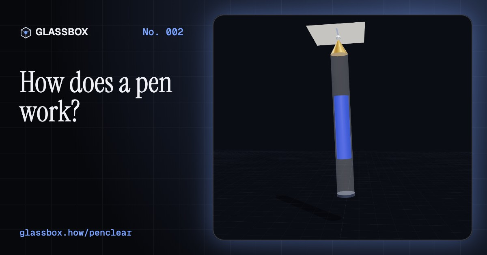
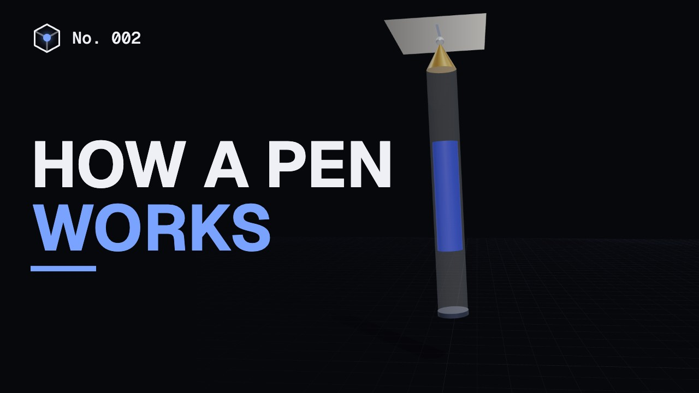
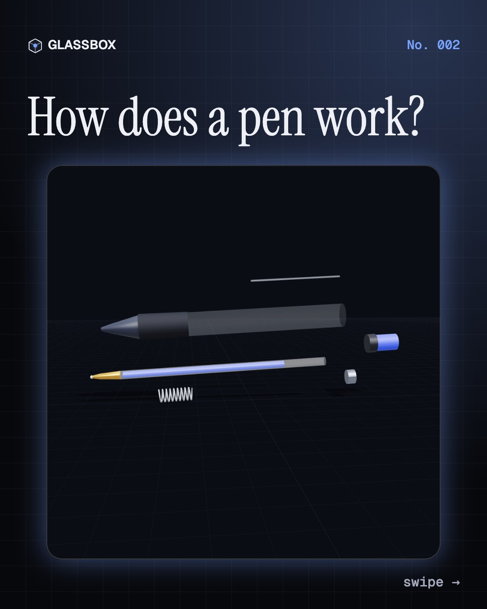
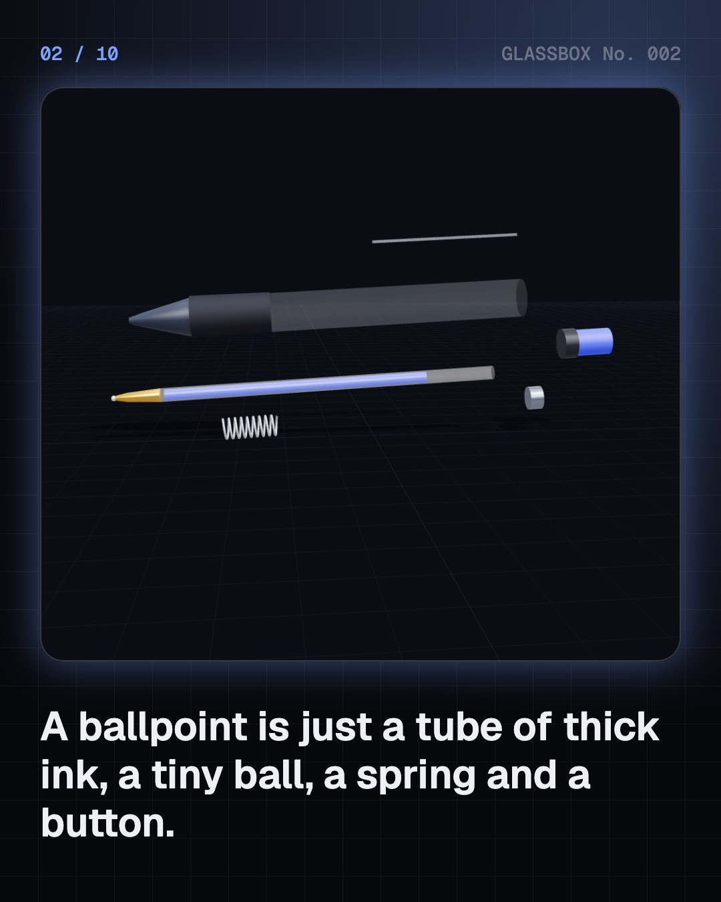
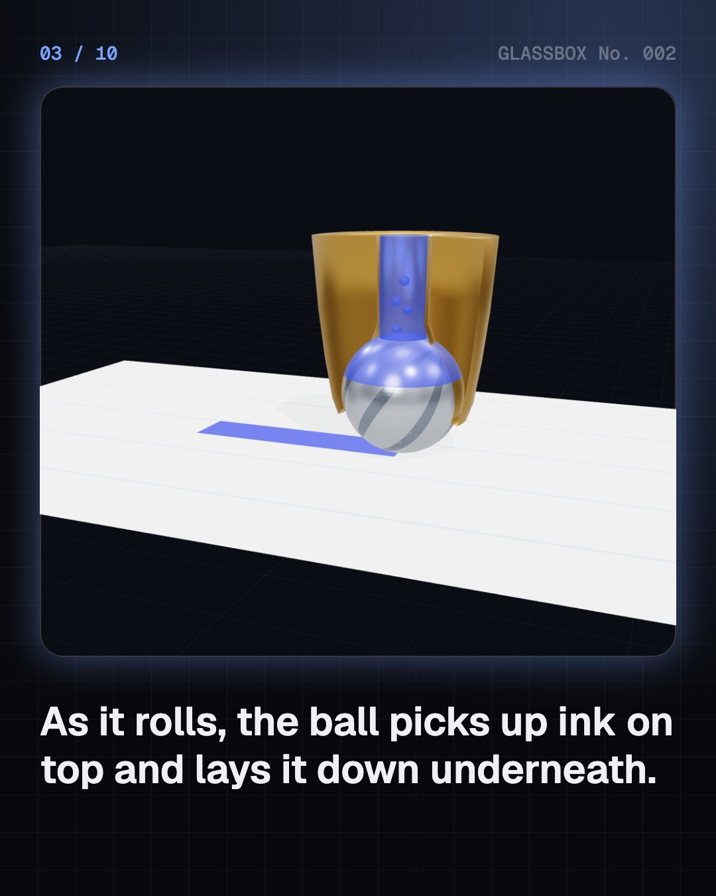
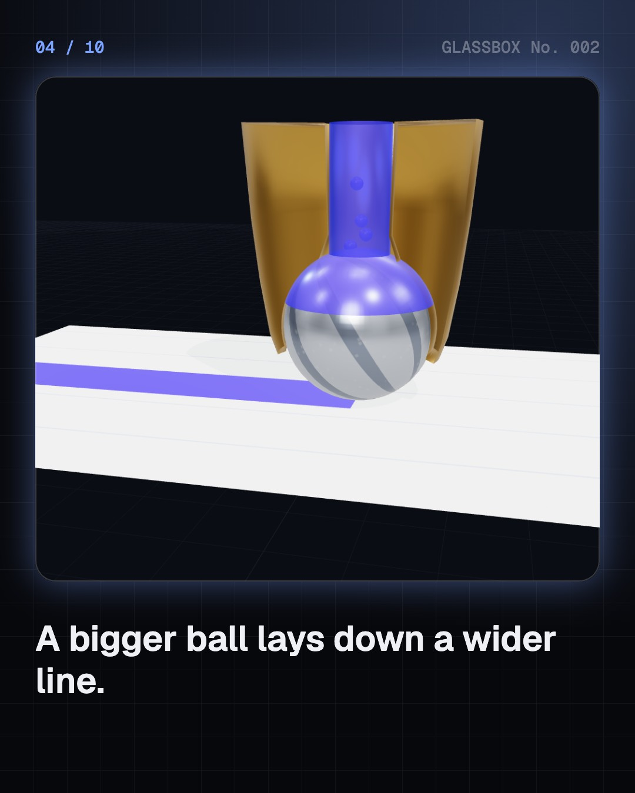

<!-- glassbox:start -->
<!-- Generated from glassbox.json by the Glassbox hub (npm run readme -- penclear). Edit glassbox.json, not this block. -->
<p align="center"><a href="https://glassbox-production-fd52.up.railway.app/e/penclear/"></a></p>

<h1 align="center">PenClear</h1>

<p align="center"><b>How does a pen work?</b><br>A tiny rolling ball, a slit thinner than a hair, and ink that climbs by itself. Take apart ballpoints and fountain pens in 3D.</p>

<p align="center"><a href="https://glassbox-production-fd52.up.railway.app/penclear/"><b>▶ Play with it</b></a> &nbsp;·&nbsp; <a href="https://glassbox-production-fd52.up.railway.app/e/penclear/">Read the 60-second explainer</a> &nbsp;·&nbsp; <a href="https://glassbox-production-fd52.up.railway.app/penclear/glassbox/reel.mp4">Watch the 40-second video</a></p>

<p align="center">
  <a href="https://glassbox-production-fd52.up.railway.app/e/penclear/"></a>
  <a href="https://glassbox-production-fd52.up.railway.app/e/penclear/"></a>
  <a href="LICENSE"></a>
  <a href="LICENSE-CONTENT.md"></a>
  <a href="#privacy"></a>
</p>

## In 60 seconds

1. **A ballpoint is a ball in a socket.** At the tip sits a tiny steel or tungsten-carbide ball, 0.5 to 1 mm across, held by a brass socket so it can spin but not fall out. Behind it is a tube of thick, oily ink.
2. **Rolling carries the ink.** Drag the pen and friction with the paper makes the ball roll. Its top is coated in ink inside the pen, and as it turns that ink is laid down on the page. Thick ink makes only a thin film, so it rarely smudges.
3. **Gravity and air keep it flowing.** Ordinary ballpoints need gravity to keep ink against the ball, and a tiny air hole so air can replace the ink that's used. Point one at the ceiling and it runs dry. Pressurized 'space pen' refills push ink out with gas instead.
4. **Fountain pens use a split nib.** A fountain pen has no ball. Its nib is split into two tines, and the slit between them is narrow enough to draw ink along it by capillary action. Press harder and the tines spread, making a wider line.
5. **Ink out, air in.** The black feed under the nib sends ink down one channel while air bubbles back up another into the reservoir. That swap stops a vacuum forming, and the feed's fins hold spare ink so the pen doesn't flood.
6. **Capillary action does the lifting.** Liquids that cling to a surface climb narrow gaps by themselves. Halve the gap and they climb twice as high. The same force pulls ink through a nib, into paper fibres and up a felt-tip's wick.

## Words worth knowing

| Term | Meaning |
|---|---|
| **Tungsten carbide** | A very hard material used for most ballpoint balls because it barely wears down. |
| **Viscosity** | How thick a liquid is. Ballpoint ink is about as thick as honey; fountain pen ink is nearly as thin as water. |
| **Capillary action** | A liquid rising in a narrow gap because it clings to the walls more than to itself. |
| **Surface tension** | The pull between molecules at a liquid's surface that makes it behave like a stretched skin. |
| **Nib** | The metal point of a fountain pen, split into two tines by a thin slit. |
| **Feed** | The part under a fountain pen's nib that sends ink out and lets air in. |
| **Cam** | A shaped part that turns a push into a rotation, like the one inside a click pen. |

## A short history

**5,000 years from a sharpened reed to a ball that rolls ink.**

- **3000 BCE** · Rush pens and soot ink (Scribes of ancient Egypt, Egypt)
- **105** · Paper (Cai Lun, Luoyang, China)
- **600** · The quill (Scribes across Europe, Europe)
- **953** · A pen that holds its own ink (Caliph al-Mu'izz li-Din Allah, Ifriqiya (today's Tunisia))
- **1822** · Machine-made steel nibs (John Mitchell, Josiah Mason, Joseph Gillott and others, Birmingham, England)
- **1884** · A feed that stops blots (Lewis Waterman, New York, USA)
- **1888** · The first ballpoint patent (John J. Loud, Weymouth, Massachusetts, USA)
- **1938** · The Bíró brothers' ballpoint (László and György Bíró, Budapest, Hungary)

The full story, with 25 moments, charts, people and 24 sources: [glassbox.how/e/penclear/history](https://glassbox-production-fd52.up.railway.app/e/penclear/history/). The data lives in [`history.json`](history.json).

## Video and slides

Made with the Glassbox studio from this box's storyboard (`window.glassbox.director`). Free to reuse under CC BY 4.0.

<a href="https://glassbox-production-fd52.up.railway.app/penclear/glassbox/video.mp4"></a>

<p><a href="glassbox/slide-1.jpg"></a> <a href="glassbox/slide-2.jpg"></a> <a href="glassbox/slide-3.jpg"></a> <a href="glassbox/slide-4.jpg"></a></p>

| File | What | Size |
|---|---|---|
| [`glassbox/reel.mp4`](https://glassbox-production-fd52.up.railway.app/penclear/glassbox/reel.mp4) | Reel / Short, with captions and soundtrack | 1080×1920 |
| [`glassbox/video.mp4`](https://glassbox-production-fd52.up.railway.app/penclear/glassbox/video.mp4) | YouTube video, with captions and soundtrack | 1920×1080 |
| `glassbox/slide-1…10.jpg` | Instagram carousel | 1080×1350 |
| `glassbox/thumb.jpg` | YouTube thumbnail | 1280×720 |
| `glassbox/cover.jpg` | Share card and repo social preview | 1200×630 |
| [`glassbox/history-reel.mp4`](https://glassbox-production-fd52.up.railway.app/penclear/glassbox/history-reel.mp4) | “History in 10 moments” Reel / Short | 1080×1920 |
| `glassbox/history-slide-*.jpg` | History carousel | 1080×1350 |
| `glassbox/post.json` | Post copy and schedule used by the publish kit | |

## Privacy

This box has no accounts and no ads, and it ships its own fonts and libraries. When you run it yourself it sends nothing anywhere. On glassbox.how, the site's `/bar.js` also loads Glassbox's analytics: **Google Analytics** to count visits (it asks first in the EU, UK and Switzerland, and stays off when your browser sends Global Privacy Control or Do Not Track) and **ClickTrust** to detect bots.

It remembers a few things **in your own browser only**, and never sends them anywhere:

| Browser storage key | What it holds |
|---|---|
| `penclear.v1` | Which chapters you have opened, your best quiz scores, and sound on or off. |

Exactly what each one sees is at [glassbox.how/privacy](https://glassbox-production-fd52.up.railway.app/privacy/).

## Licences

- **Code:** [MIT](LICENSE). Use it, change it, ship it.
- **Explanations, text, images and videos** (`glassbox.json`, `glassbox/`): [CC BY 4.0](LICENSE-CONTENT.md). Credit “Glassbox, glassbox.how/e/penclear”.
- **Third-party parts** keep their own licences: [three.js](https://threejs.org) (MIT), [Geist, Instrument Serif](https://openfontlicense.org) (SIL OFL 1.1).
- The Glassbox name and logo aren't covered by either licence. See the [terms](https://glassbox-production-fd52.up.railway.app/terms/).

Found a mistake? [Open an issue](https://github.com/bdeeps/penclear/issues). Corrections happen in public.
<!-- glassbox:end -->

## Run it

It's plain HTML, CSS and JavaScript. No build step and no dependencies. Run locally, it contacts no other website.

```bash
python3 -m http.server 8000
```

Three.js and the fonts ship in `vendor/` and `fonts/`, so it also works offline.

Then open http://localhost:8000.

## How it's built

| File | What |
|---|---|
| `index.html`, `css/app.css` | The page and its styles |
| `js/app.js`, `js/stage.js`, `js/ui.js`, `js/kit.js` | The shared Glassbox 3D engine: chapters, 3D stage, controls, quiz, video director |
| `js/chapters/*.js` | One file per chapter: the 3D model, controls, text, key terms, quiz and video scenes |
| `glassbox.json` | Title, question, explainer beats, key terms, browser storage and credits shown on glassbox.how |
| `reel` in each chapter | The storyboard the Glassbox studio records into short videos |
| `glassbox/` | The published video, slides, thumbnail and post copy |
| `fonts/`, `vendor/three/` | Self-hosted Geist and Instrument Serif (SIL OFL 1.1) and three.js (MIT) |
